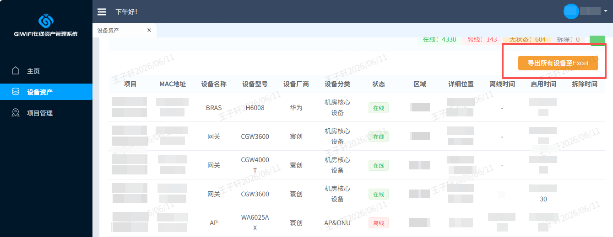

# GCMS设备导出助手

用于寰创GCMS资产管理平台设备管理页面导出所有已采集结果为Excel文件。

## 功能介绍

- **批量账号检查**：用于寰创GCMS资产管理平台设备管理页面导出所有已采集结果为Excel文件

## 运行环境

- 浏览器：Chrome 111+
- 或已安装篡改猴

## 使用方法

在浏览器或篡改猴安装本插件后打开GCMS资产管理平台登录并进入设备资产->项目设备页面即可点击本插件提供的额外按钮功能

## 注意事项

- 本插件提供Chrome插件版本（.crx）文件和油猴插件版本(.js)文件，根据需求选择下载对应版本安装即可

## 运行截图

